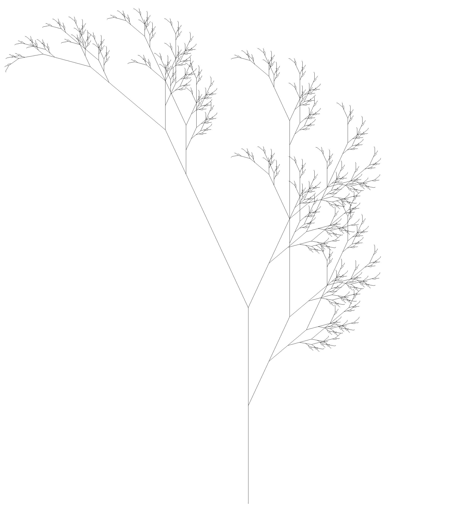
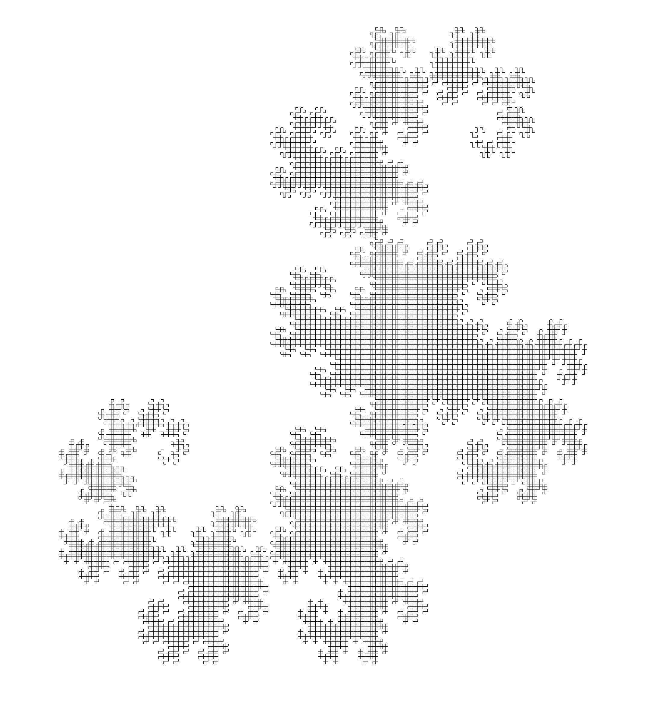

# L-Systems

> An L-system or Lindenmayer system is a parallel rewriting system and a type of formal grammar.
>
> -- <cite> [Wikipedia](https://en.wikipedia.org/wiki/L-system) </cite>

## Quick description

The goal of this project was to explore the wonderful world of L-Systems.
It is still a work in progress,

## Getting started

To build the project you will need to have the following installed :
```
make stack glut
```

You can then build the project by with makes


Then you can run it by typing the following command :
```
./L-Systems-exe [--generation GEN] [--animate] --file FILE
```
For now the animate flag doesn't do anything. If the generation option is not used then the program will run forever. It is recommended to keep the generation between 8 & 16 depending on the LSystem used.


## Some examples

### Fern leaf:

```
angle 25
axiom X
X -> F-[[X]+]+F[+FX]-X
F -> FF
```


### Dragon curve:

```
angle 90
axiom X
X -> X+YF+
Y -> -FX-Y
```

